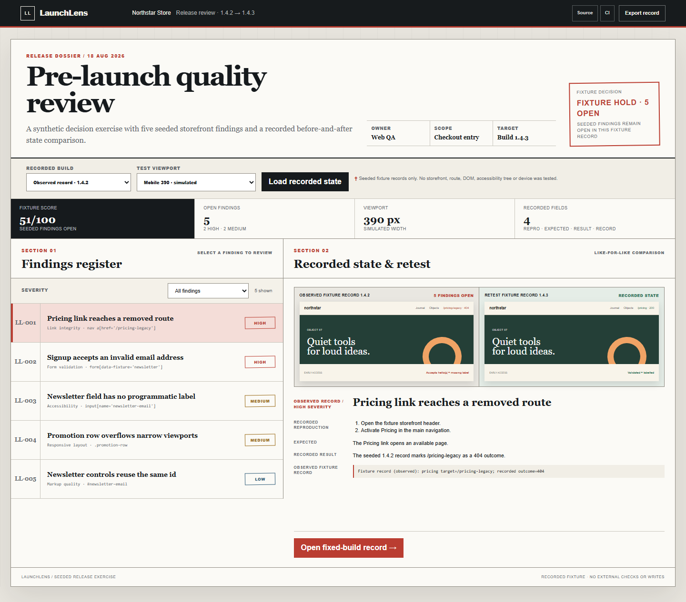

# LaunchLens

LaunchLens is a compact presentation and report model for an invented storefront release review. It compares two deterministic records for five deliberately seeded findings; it does not scan a storefront or execute the fixture's route, form, DOM, accessibility or layout checks.

[Source](https://github.com/x3r3S/launchlens-release-qa) · [CI history](https://github.com/x3r3S/launchlens-release-qa/actions)



## The workflow

1. Review the seeded `1.4.2` record at a simulated viewport.
2. Open a finding with its severity, intended reproduction steps, expected behaviour and recorded result.
3. Switch to the `1.4.3` record for a like-for-like state comparison.
4. Export the selected fixture record as JSON.

The default Mobile 390 record has a model score of **51/100** with five open findings. The `1.4.3` record marks those findings resolved and has a model score of **100/100**. These are generated fixture values, cross-checked against the written record during `pnpm run verify`; they are not measurements from a real product.

## Fixture records you can inspect

- [Seeded LL-001 case record](evidence/LL-001-pricing-link.md)
- [Build 1.4.3 recorded comparison](evidence/retest-1.4.3.md)
- [Implementation and testing notes](docs/implementation-notes.md)
- [Retest record correction](docs/retest-evidence-fix.md)
- [Short review walkthrough](docs/walkthrough.md)
- [Recorded walkthrough](proof/launchlens-qa-walkthrough.webm)

## Run locally

Requirements: Node.js 20 or newer and pnpm 11. There are no runtime dependencies; Playwright is a development dependency for the browser regression.

```bash
pnpm install
pnpm exec playwright install chromium
pnpm run demo
```

Open `http://127.0.0.1:4173/`.

Run the complete verification gate:

```bash
pnpm run verify
```

That command checks JavaScript syntax, runs the record-model tests, verifies that the Markdown records still match the model, exercises the LaunchLens interface in Chromium at desktop and 390 px widths, and checks every file against the public SHA-256 manifest. The browser regression tests this interface and its responsive layout; it does not execute the seeded storefront findings.

## Repository map

```text
src/domain.mjs        deterministic fixture records and report model
src/app.mjs           browser interaction and recorded-state rendering
tests/                focused domain tests
tests/browser/        LaunchLens UI state, links and responsive regressions
evidence/             one seeded case and the recorded state comparison
playwright.config.mjs browser test and local-server configuration
scripts/verify-proof.mjs  evidence-to-code consistency check
scripts/verify-manifest.mjs  public-file integrity check
proof/                short recorded walkthrough
screenshots/          desktop and mobile review images
```

## Project boundary

This is a self-initiated portfolio case using an invented storefront and deliberately seeded records. The viewport matrix and finding outcomes are hard-coded teaching data. They are not evidence of HTTP requests, form submission, DOM inspection, accessibility-tree inspection, storefront geometry, Safari, iOS, Android or physical-device coverage. Playwright checks only the LaunchLens presentation itself. The app makes no external requests and writes only the fixture-record file the reviewer explicitly exports.

The source is published for portfolio review. See [PORTFOLIO-REVIEW-LICENSE.md](PORTFOLIO-REVIEW-LICENSE.md) before reusing it.
